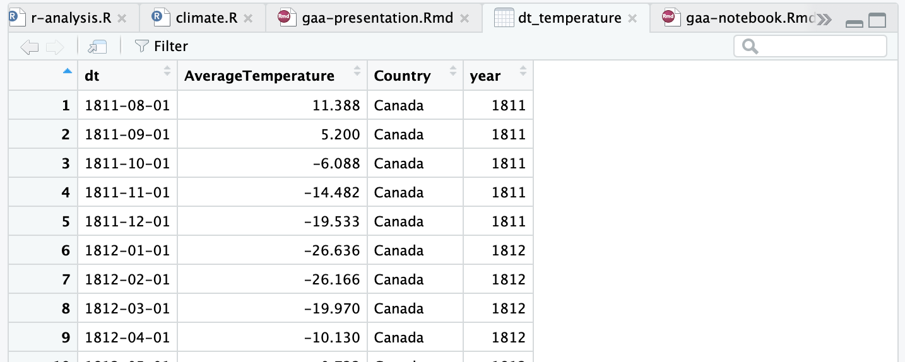

```{r setup, include=FALSE}
knitr::opts_chunk$set(echo = FALSE)
knitr::opts_chunk$set(comment = NA)
knitr::opts_chunk$set(tidy = TRUE)
knitr::opts_chunk$set(message = FALSE)
knitr::opts_chunk$set(warning = FALSE)
```

```{r, echo = FALSE}
if (!require("ggplot2")) install.packages("ggplot2")
library("ggplot2")
if (!require("ggpubr")) install.packages("ggpubr")
library("ggpubr")
if (!require("dplyr")) install.packages("dplyr")
library("dplyr")
if (!require("janitor")) install.packages("janitor")
library("janitor")
if (!require("stringr")) install.packages("stringr")
library("stringr")
if (!require("tidyverse")) install.packages("tidyverse")
library("tidyverse")

scale2Decimals <- function(x) sprintf("%.2f", x)
```

## R 

Allows you to analyze data easily 

R has a huge community and many solutions are available online

Many libraries offer ease abstractions to analyze and plot data

## About environmental awareness

R allows you to load data in many formats (e.g. csv files)

```{r echo = TRUE}
globalTemperatures <- read_csv("GlobalTemperatures.csv")
head(globalTemperatures, n=5)
```


## Data manipulation

You can select columns and filter data in an ease and readable syntax

```{r echo = TRUE}
select(
  filter(globalTemperatures, dt > as.Date("1800-01-01")), 
  dt, LandAverageTemperature
)
```

## Data manipulation

<center>


</center>


## Data manipulation

<center>


</center>


## Data transformation

You can also transform your data applying **mutate** operators (e.g. converting a `date` field to a `numeric` year field) as you seem fit

```{r echo = TRUE}
dt_temperature <- globalTemperatures %>%
  filter(dt > as.Date("1800-01-01")) %>%
  select(dt, LandAverageTemperature) %>%
  mutate(year = as.numeric(format(dt, "%Y")))

head(dt_temperature, n=5)
```

## Data visualization

```{r echo = FALSE}
avg_temp_by_year <- dt_temperature %>%
  group_by(year) %>%
  summarise(avg_temp = mean(LandAverageTemperature))
```

```{r echo = TRUE}
p <- ggplot(data=avg_temp_by_year, aes(x=year, y=avg_temp)) +
  geom_line()
```

```{r echo = FALSE}
p <- p +
  scale_x_continuous(breaks = seq(min(avg_temp_by_year %>% select(year)), max(avg_temp_by_year %>%select(year)), by = 25)) +
  scale_y_continuous(labels=scale2Decimals, breaks = seq(min(avg_temp_by_year %>% select(avg_temp)), max(avg_temp_by_year %>%select(avg_temp)), by = .2)
  ) +
  geom_hline(yintercept=9.0, linetype="dashed", color = "red")
```


```{r fig.width=6, fig.height=4, out.extra='style="padding-left:160px; display: inline-block;"', echo=TRUE}
p
```


## Hypothesis Testing

How is the temperature around our neighbours?

```{r echo = TRUE}
globalTemperaturesByCountry <- read_csv("GlobalLandTemperaturesByCountry.csv")
unique(globalTemperaturesByCountry %>% select(Country))
```

## Data transformation

Libraries such as `dplyr` and `tidyverse` allow cleaning our data and removing non-valid entries (e.g. **na.omit()**)

```{r echo = TRUE}
dt_temperature <- globalTemperaturesByCountry %>%
  na.omit() %>%
  filter(dt > as.Date("1800-01-01")) %>%
  filter(Country == 'Canada' | Country == 'China' | Country == 'United States') %>%
  select(dt, AverageTemperature, Country) %>%
  mutate(year = as.numeric(format(dt, "%Y")))

head(dt_temperature, n=5)
```

## Comparing data visually

```{r echo = TRUE}
p <- ggplot(data=dt_temperature, aes(x=Country, y=AverageTemperature, colour=Country)) +
  geom_boxplot() 
```

```{r echo = FALSE}
p <- p +
  scale_y_continuous(
    labels=scale2Decimals,
    breaks = seq(min(dt_temperature %>% select(AverageTemperature)), max(dt_temperature %>%select(AverageTemperature)), by = 5)
  )
```

```{r out.extra='style="padding-left:160px; display: inline-block;"', echo = TRUE}
p
```

## Testing Normal Distribution

```{r out.extra='style="padding-left:160px; display: inline-block;"', echo = TRUE}
ggdensity(dt_temperature$AverageTemperature, 
          main = "Density plot of Average Temperature",
          xlab = "Average Temperature")
```


## Checking if our data has an equal number of entries for comparison

```{r echo = TRUE}
us_temp <- dt_temperature %>% filter(Country == 'United States') %>% select(AverageTemperature)
cn_temp <- dt_temperature %>% filter(Country == 'China') %>% select(AverageTemperature)
ca_temp <- dt_temperature %>% filter(Country == 'Canada') %>% select(AverageTemperature)

length(us_temp$AverageTemperature)
length(cn_temp$AverageTemperature)
length(ca_temp$AverageTemperature)
```

## Creating a data frame for comparison


```{r echo = FALSE}
random_samples <- min(length(us_temp$AverageTemperature), length(cn_temp$AverageTemperature), length(ca_temp$AverageTemperature))

temperature <- c()
country <- c()

us_temp <- sample(us_temp$AverageTemperature, random_samples)
temperature <- c(temperature, us_temp)
country <- c(country, rep("United States", random_samples))

cn_temp <- sample(cn_temp$AverageTemperature, random_samples)
temperature <- c(temperature, cn_temp)
country <- c(country, rep("China", random_samples))

```


```{r echo = TRUE}
ca_temp <- sample(ca_temp$AverageTemperature, random_samples)
temperature <- c(temperature, ca_temp)
country <- c(country, rep("Canada", random_samples))
```

```{r echo = TRUE}
df <- data.frame(AverageTemperature=temperature, Country=country)
head(df, n=5)
```


## Hypothesis testing

```{r echo = TRUE}
kruskal.test(Country ~ AverageTemperature, data = df)
```

## RStudio is awesome!

Did I mention that this notebook was created on RStudio?

## Thanks

## RStudio is awesome!

<center>


</center>